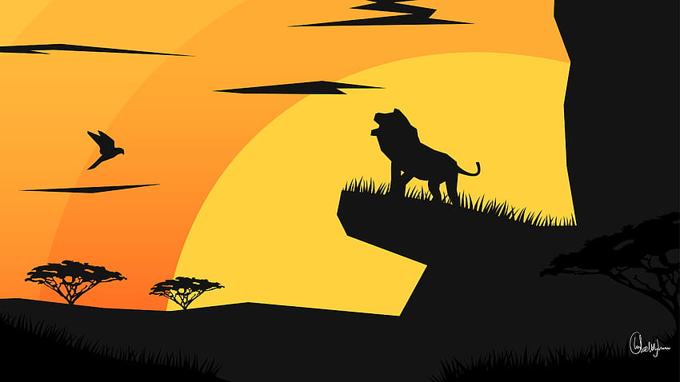

# Mid-Term Project: Interactive Poster - The Lion King

## Project Overview
This project is part of my mid-term assignment, where I am creating an interactive and time-based digital poster inspired by Disney’s *The Lion King*. The poster combines technical skills with creative design, showcasing themes from the movie using programming structures such as loops, objects, arrays, and conditional statements.

## Project Details
### Movie Chosen
- **Title:** *The Lion King*
- **Description:** 
  *The Lion King* is a Disney animated film that follows Simba, a young lion prince, as he struggles to accept his role as the rightful heir to the Pride Lands after the tragic death of his father, Mufasa. The story is one of self-discovery, redemption, and the "circle of life," emphasizing themes like family, leadership, and courage.

## Aspects Included in the Poster
- The interactive poster will depict central themes and scenes from the movie, such as:
  - **The “Circle of Life” sunrise scene**, symbolizing renewal and the progression of life.
  - **Pride Rock silhouette**, representing Simba's journey to the throne.
  - **Simba’s transformation from cub to king**, illustrating his character growth.
- The cover will utilize circular shapes to represent the "circle of life," emphasizing the film’s core themes.

## Interactivity and Time-based Elements
- **Time-based Elements**:
  - The sun will rise gradually in the background, representing the passage of time and the theme of growth in the movie.
- **Interactive Features**:
  - **Mouse Events**: Clicking the mouse will trigger changes in the scene, such as Simba’s appearance on Pride Rock or a ripple effect that symbolizes impact and change.
  - **Keyboard Events**: Different stages of Simba’s life (cub to adult) will appear based on the keys pressed, symbolizing his character development.

## Ideas to Explore/Experiment With
- **Custom Functions**: 
  - To animate the sun’s ascent and other moving elements.
- **Arrays**:
  - To create stars that appear randomly and fade in the night sky, adding to the dynamic nature of the poster.
- **Objects/Classes**:
  - Simba will be represented using object or classes, with different visual states that change based on user interaction.
- **Loops**:
  - To generate repetitive patterns, such as the waves of grass in the savannah.
- **If() Statements**:
  - To trigger changes based on user input or elapsed time, such as transforming Simba from a cub to a fully-grown lion.

## Connections to Readings
- The use of programming structures like loops, objects, and arrays aligns with our readings on interactive design.
- The focus on interactive and time-based design draws from discussions on how users engage with digital narratives, ensuring that elements of the story are represented through interaction.

## Sketch
- The attached sketch includes the proposed design elements:
  - **Top Section**: Rising sun over Pride Rock.
  - **Middle Section**: Simba’s transformation stages.
  - **Bottom Section**: Waves of grass in the savannah.

## Progress Write-up (Milestone 2)

### Work Completed This Week
This week, I focused on planning and implementing the abstract design of the interactive poster in p5.js. Following feedback, I shifted towards a more abstract representation of *The Lion King*, using shapes and colors to depict key themes. I created pseudo-code for the logic and added initial code for basic elements, including the sunrise, abstract shapes for Simba’s growth, and twinkling stars.

### Project Structure and Organization
- **Project Moments/Scenes:** 
  - The project is organized into three abstract moments:
    1. **Abstract Sunrise:** A gradient circle rises, symbolizing the "Circle of Life."
    2. **Simba’s Abstract Growth:** Shapes change size and color based on keyboard input, reflecting different life stages.
    3. **Starry Night Scene:** Stars twinkle in the sky, with ripple effects appearing on mouse clicks.
- **Interactive Events:**
  - **Mouse Events:** Clicking on the canvas triggers ripple effects.
  - **Keyboard Events:** Pressing different keys changes the properties of abstract shapes, representing Simba’s growth.
  - **Time-based Events:** The sun gradually rises and changes color.
- **Files, Classes, and Objects:**
  - **index.html**: Contains HTML structure.
  - **style.css**: Manages the layout of the canvas.
  - **script.js**: The main p5.js file for the code logic.
  - **Objects:**
    - `Sun`: Class for the sun animation.
    - `SimbaShape`: Class for abstract shapes.
    - `Star`: Class for twinkling stars.
  - **Arrays:**
    - Array to hold instances of `Star`.
    - Array for expanding circles representing ripple effects.
- **Interactivity and Time-based Logic:**
  - The sun’s movement is based on elapsed time.
  - Mouse clicks create expanding circles.
  - Keyboard inputs alter `SimbaShape` properties.
- **Custom Functions:**
  - `drawSun()`: Animates the rising sun.
  - `createRipple(x, y)`: Generates expanding circles.
  - `changeSimbaState(key)`: Changes abstract shape properties.
  - `drawStars()`: Manages twinkling stars.
  - `updateScene()`: Handles canvas updates.

## Next Steps
- Implement additional interactions, refine abstract shapes, and complete all planned functions.
- Continue testing and adjusting animations for smooth transitions.

## Milestone 3 (Final Version)

### What I’ve Done This Week
- Completed the final code for all interactive and time-based features.
- Refined the ripple effect and added more dynamic star twinkling.
- Polished Simba’s transformations to ensure smooth transitions across his growth stages.
- Finalized documentation and presentation materials.

### Final Interactivity and Time-Based Logic
- **Sun Movement**: The sun rises continuously, resetting once it reaches the top of the screen, symbolizing the cycle of life.
- **Star Twinkling**: Stars randomly vary in brightness, creating a realistic night sky.
- **Simba’s Transformation**: The keyboard controls allow users to switch between Simba’s life stages, representing his character growth.
- **Ripple Effect**: Each mouse click creates an expanding ripple, symbolizing Simba’s impact on his surroundings.

### Visuals and Sketches
1. **Simba as a Cub**  
   
2. **Simba as Young Lion**  
   
3. **Simba as King**  
   
4. **Ripple Effect**  
   
5. **Sunrise and Starry Sky**  
   
